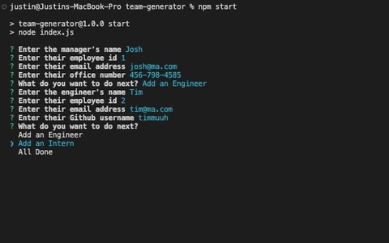

# Team Generator
Generates a team page

# Description
This project uses NodeJS and Inquirer to create a web page with team members and their infomation.

# Completed Task
- Prompts users to answer questions for building the team
- Prompts user for what team member they would like to add
- Uses that data to fill in the different sections
- Outputs all the user data in to a team page

# Links
[Code Repository](https://github.com/Justin-Brueske/team-generator)

[Video](./assets/team-generator.mp4)

# Insatllation
You need to have NodeJS installed
And install Inquirer with the files

# Usage
Can be run with NodeJS

